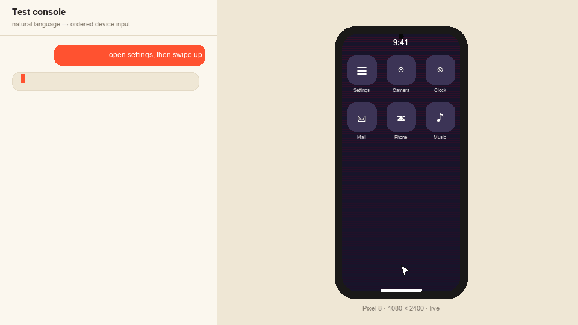

<div align="center">

# 📱 Shared Device Lab

### Real Android devices — leased fairly, tested in plain English.

Request a live Android emulator, get an **exclusive, crash-safe lease** streamed to your
browser, and drive it by touch **or by typing what you want** — an on-screen cursor flies
across the device and does it. A fair FIFO queue hands the device to the next tester the
moment you're done.

**[▶ Try the live demo →](https://shared-device-lab-web.fly.dev)**

<br />



<br /><br />

`TypeScript` · `Fastify` · `Redis (Lua)` · `WebSocket` · `React + Vite` · `ADB / scrcpy` · `Fly.io`

</div>

---

> A miniature **execution substrate for mobile QA**: a browser user leases a device today;
> a QA agent leases one through the same scheduler API next; a physical-device adapter
> replaces the emulator adapter later without touching queueing, leases, input ordering, or
> recovery. A device farm is a distributed ownership system with video attached — not a
> screen-sharing demo.

## ✨ Try it in 60 seconds (no install)

1. Open **[shared-device-lab-web.fly.dev](https://shared-device-lab-web.fly.dev)** in a few
   browser windows.
2. Hit **Request a device** in three windows → each gets a *different Pixel* (8, 4a, 3).
3. In a fourth window, **Request a device** → watch your live queue position.
4. In an active window, open the **test console** and type:
   `open settings, then swipe up, then tap the center` — watch the cursor execute each step.
5. **End** one session → the queued window is served automatically.

> Devices are this laptop's emulators, attached to the cloud over a reverse tunnel — the
> same mechanism a physical device farm would use. If the pool shows `0 offline` it's live;
> if a device is offline, the lab owner just needs to reconnect the tunnel.

## 🚀 Run it locally

```bash
make doctor      # verify node, pnpm, redis, adb, emulator, ffmpeg
make setup       # pnpm install + .env
make avds        # create three AVDs (one-time)
make emulators   # boot all three headless, wait for full boot
make devices     # give each emulator a real Pixel profile (8 / 4a / 3)
make infra       # start Redis
make dev         # server on :4000, web on :5173
```

Then open **http://localhost:5173** in four windows. See **[docs/DEMO.md](docs/DEMO.md)** for
the full walkthrough, `make demo` for the scripted four-client flow, and `make fault-demo`
for the `kill -9` recovery scenario.

## 🧠 What makes it real

| | |
|---|---|
| **Atomic, fair allocation** | One Lua transaction pops a device + the oldest waiter + bumps a fencing token. Two allocators **cannot** double-assign — proven by a race test (8 allocators, 1 device, exactly one owner). |
| **Crash-safe by design** | TTL leases + a reaper + startup reconciliation survive `kill -9` with **no shutdown hooks**. Refreshing your tab keeps your session. |
| **Ordered, fenced input** | Strict sequence numbers, serial per-session execution, ACK-after-ADB, dedupe, gap rejection. A stale-fence command from a dead session touches the device **zero** times. |
| **Natural-language console** | A deterministic parser (instant, offline) with an **LLM fallback** compiles English into the *same* ordered input protocol — every LLM step re-validated before it runs. |
| **Cleanup before reuse** | Devices are cleaned + health-checked before reassignment; repeated failure marks them `OFFLINE` instead of serving them dirty. |
| **Three real Pixels** | Pixel 8 (20:9), Pixel 4a (19.5:9), Pixel 3 (18:9) — distinct resolutions, frames, and camera cutouts — with latest-frame-wins stream backpressure. |

## 🏗 Architecture

All correctness-bearing state (queue, sessions, ownership, fencing tokens, leases, events)
lives in **Redis**, and every multi-key transition is a single **Lua script** — atomic
allocation, termination, and health transitions. The Node process holds only rebuildable
runtime: sockets, capture subprocesses, input executors.

```
Browser ──HTTP/WS──▶ Gateway ─▶ Scheduler ─▶ Redis (Lua · leases · fences)
                        │                        ▲
                        ├─ NL compiler (LLM)      │ reaper / reconciler
                        ├─ Ordered input executor │
                        └─ Stream fan-out ─▶ ADB adapter ─▶ 3 emulators
```

Modules are split along the seams that would become process boundaries in a real farm:
gateway, scheduler, session service, device registry, ADB adapter (its own package,
swappable for physical devices), stream fan-out, input executor, cleanup worker, reaper,
telemetry. Full write-up in **[docs/DESIGN.md](docs/DESIGN.md)**.

## 📊 Measured performance

Real numbers from `make benchmark` (never estimated). Apple M5 Pro, three Android 14 AVDs.

| Metric | 1 stream | 3 streams |
|---|---:|---:|
| Delivered FPS (under motion) | **33** | **27** |
| Tap → visible-change p50 | **97 ms** | 117 ms |
| Tap → visible-change p95 | 132 ms | 161 ms |
| Input RTT (ADB apply) p50 | 296 ms | 302 ms |
| Allocation time | 11 ms | — |
| Server CPU / RSS (median) | 1.4% / 86 MB | 2.7% / 100 MB |

Peak is ~60 fps under continuous animation; the stream is change-driven so idle screens
cost ~0. **Bottleneck:** the `screenrecord` → ffmpeg MJPEG transcode. **Highest-leverage
fix:** ship H.264 to the browser and decode with WebCodecs, deleting the re-encode — see
[docs/ANSWERS.md](docs/ANSWERS.md).

## 🎬 Demo & docs

- **[docs/DEMO_SCRIPT.md](docs/DEMO_SCRIPT.md)** — shot-by-shot 4-minute demo-video script
- **[docs/DEMO.md](docs/DEMO.md)** — reviewer walkthrough + commands
- **[docs/ANSWERS.md](docs/ANSWERS.md)** — the four assignment questions, answered
- **[docs/DESIGN.md](docs/DESIGN.md)** — architecture & state machines

## 🔒 Notes

- Streams render at half each Pixel's real resolution (exact aspect ratio) so three feeds
  stay smooth over the cloud tunnel; the UI labels each with its real model + full spec.
- The LLM key is a **server-side Fly secret** — never shipped to the browser; the feature
  is optional (unset key → deterministic parser only).
- 45 automated tests: allocation races, FIFO/starvation, input order/fencing,
  reconnect/timeout, crash recovery, backpressure, coordinate mapping, NL parsing.
  `make test`.

## ☁️ Deploy (Fly.io)

| App | Role |
|---|---|
| `shared-device-lab-web` | static web UI (nginx) |
| `shared-device-lab-api` | orchestrator (Node + adb + ffmpeg) |
| `shared-device-lab-redis` | private Redis (volume + auth) |
| `shared-device-lab-tunnel` | chisel reverse tunnel for device attach |

`make deploy` builds and ships all of them. Devices join from any machine running
`scripts/attach-devices-to-cloud.sh`.

---

<div align="center">
<sub>Built as a take-home. Correctness, observable behavior, crash recovery, and a clean
demo over decorative features.</sub>
</div>
